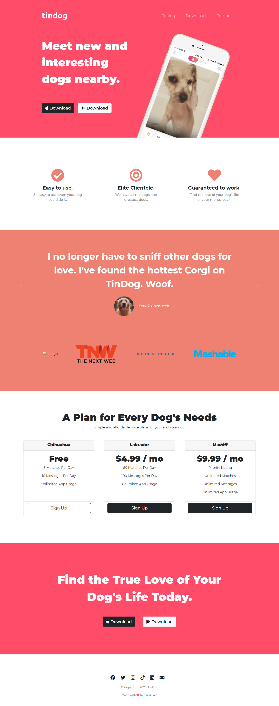

# Tindog

A fully responsive landing page for fictional start-up company Tindog.
It allows users to find other dogs & their owners nearby in the swipe left/right style made famous by Tinder.

## Table of Contents

- [Deployment](#deployment)
- [Built With](#built-with)
- [Author(s)](#authors)
- [License](#license)
- [Acknowledgement](#acknowledgement)

 

## Deployment

**[Live Demo: https://savarj.github.io/tindog/](https://savarj.github.io/tindog/)**

 

## Built With

- [HTML](https://developer.mozilla.org/en-US/docs/Web/HTML)
- [CSS](https://developer.mozilla.org/en-US/docs/Web/CSS)
- [Bootstrap](https://getbootstrap.com/docs/5.0/getting-started/introduction/)

## Author(s)

- **[Savar Jain](https://jainsavar.com)**

## License

Copyright (c) 2021 Savar Jain

Licensed under the [MIT License](LICENSE)

## Acknowledgement

- The Complete 2021 Web Development Bootcamp by Dr. Angela Yu
